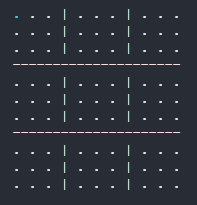
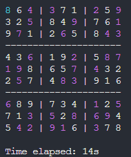

# sudoku-bruteforce


Simple C++ script to simulate bruteforcing a sudoku puzzle in real time.

> [!NOTE]
> This is not an optimal way of solving a sudoku puzzle, because it's not meant to be. I made this to see how long it can take to bruteforce some puzzles, rather than to pretend bruteforcing is a good strategy.

<br>

# the plan

- [x] create a functional version
- [x] add a timer
- [x] improve graphical representation
- [ ] add replay speed customization options
- [x] add other input options
- [ ] make the code compatible with Linux and MacOS

_(all pull requests are welcome)_

<br>

# installation and execution

To install the script, run

```bash
git clone https://github.com/Kamix-08/sudoku-bruteforce
cd sudoku-bruteforce
```

<br>

To run the program, use the complier of your choice to compile the `main.cpp` file into an executable.

_(an example using `gcc`)_

```bash
g++ -o main main.cpp
```

<br>

## flags

If you execute the program with no flags:

```bash
./main
```

you will be prompted with an empty sudoku board, such as this one:



You can use arrow keys to navigate and 0-9 keys to change the values in the cells.

After you fill in the whole board, you can press `Enter` to let the program run.

---

Alternately, you can use the following flags:

| Flag | Description |
|:-----|:------------|
|`-h`  | Displays the help menu and exits. |
|`-n`  | Don't print the board while bruteforcing. |
|`-s`  | Executes the program without asking for user input. |
|`-b <board>` | Setups the board with the specified string of 81 characters. |

<br>

Example:

```bash
./main -s -b ..43..2.9..5..9..1.7..6..43..6..2.8719...74...5..83...6.....1.5..35.869..4291.3..
```

This will start solving the given board without waiting for user input.

## results

The program will _eventually_ find the solution, if one exists.



If it doesn't, the program will output the following message:

    [x] Failed to find the solution...

